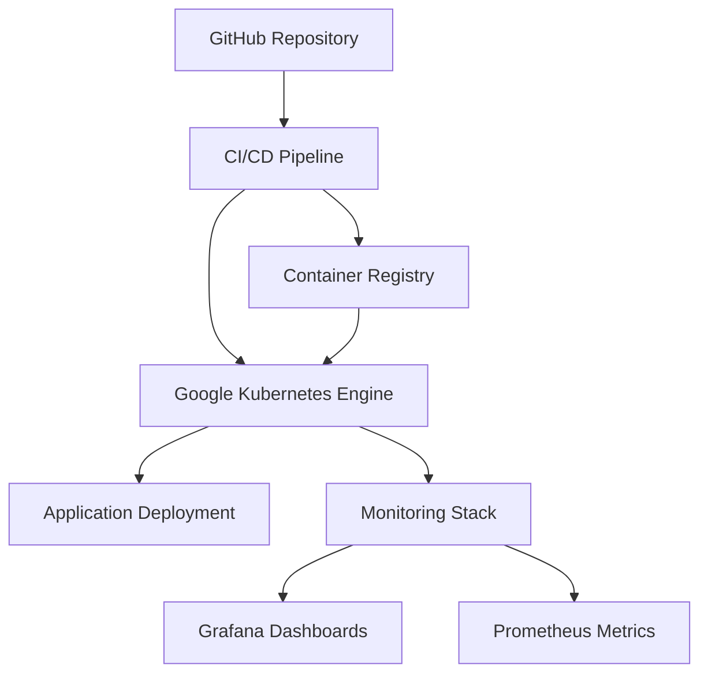

# DevOps Toolchain Project

A comprehensive DevOps infrastructure implementation on Google Cloud Platform with automated CI/CD pipelines, robust monitoring, and infrastructure as code.

## Overview

This project establishes a modern DevOps toolchain using Google Kubernetes Engine (GKE) with integrated CI/CD practices, monitoring solutions, and infrastructure automation. The implementation follows cloud-native principles to enable consistent, reliable, and secure application deployments.

## Features

- **Infrastructure as Code**: Complete GCP infrastructure defined and managed through Terraform
- **Container Orchestration**: GKE cluster with custom node pools and networking
- **CI/CD Automation**: GitHub Actions pipelines for streamlined build, test, and deployment
- **Monitoring Stack**: Prometheus and Grafana for comprehensive observability
- **Security Integration**: Built-in security scanning with Trivy and compliance checks
- **Scalability**: Automatic scaling capabilities at infrastructure and application levels

## Architecture

The toolchain implements a multi-layer architecture:

## Technology Stack

- **Cloud Platform**: Google Cloud Platform (GCP)
- **Container Orchestration**: Google Kubernetes Engine (GKE)
- **Infrastructure as Code**: Terraform
- **CI/CD**: GitHub Actions
- **Containerization**: Docker
- **Monitoring**: Prometheus, Grafana, Cloud Logging
- **Security**: Trivy, SonarQube, IAM policies
- **Application Runtime**: Node.js

## Getting Started

### Prerequisites

- Google Cloud Platform account with appropriate permissions
- GitHub account
- Terraform installed locally
- Google Cloud SDK installed

### Setup Instructions

1. Clone this repository
2. Configure GCP credentials
3. Initialize Terraform workspace
4. Apply infrastructure configuration
5. Configure GitHub Actions secrets
6. Push application code to trigger CI/CD pipeline

Detailed setup documentation is available in the [docs](/docs) directory.

## Components

- `terraform/`: Infrastructure definitions for GCP resources
- `k8s/`: Kubernetes manifests for application deployments
- `monitoring/`: Prometheus and Grafana configurations
- `pipelines/`: GitHub Actions workflow definitions
- `docs/`: Comprehensive documentation

## Roadmap

- Istio service mesh integration
- Advanced canary deployment capabilities
- Machine learning pipeline integration
- Enhanced security scanning procedures
- Cost optimization refinements

## Contributing

Contributions are welcome! Please read our [Contributing Guide](CONTRIBUTING.md) for details on the process for submitting pull requests.

## License

This project is licensed under the MIT License - see the [LICENSE](LICENSE) file for details.
