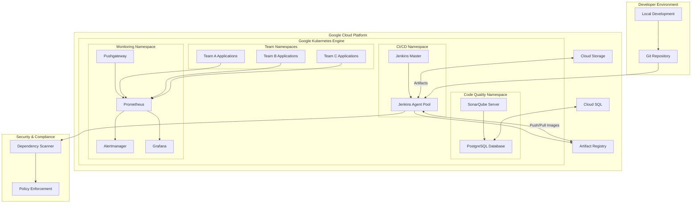

```mermaid
graph TD
    subgraph "Google Cloud Platform"
        subgraph "Google Kubernetes Engine"
            subgraph "CI/CD Namespace"
                A[Jenkins Master] --> B[Jenkins Agent Pool]
            end
            
            subgraph "Code Quality Namespace"
                C[SonarQube Server] --> D[PostgreSQL Database]
            end
            
            subgraph "Monitoring Namespace"
                E[Prometheus] --> F[Alertmanager]
                E --> G[Grafana]
                H[Pushgateway] --> E
            end
            
            subgraph "Team Namespaces"
                I[Team A Applications]
                J[Team B Applications]
                K[Team C Applications]
            end
            
            I --> E
            J --> E
            K --> E
        end
        
        L[Cloud SQL] <--> D
        M[Artifact Registry] <-- Push/Pull Images --> B
        N[Cloud Storage] <-- Artifacts --> B
    end
    
    subgraph "Developer Environment"
        O[Git Repository] --> B
        P[Local Development] --> O
    end
    
    subgraph "Security & Compliance"
        Q[Dependency Scanner]
        R[Policy Enforcement]
    end
    
    B --> M
    B --> Q
    Q --> R
```
